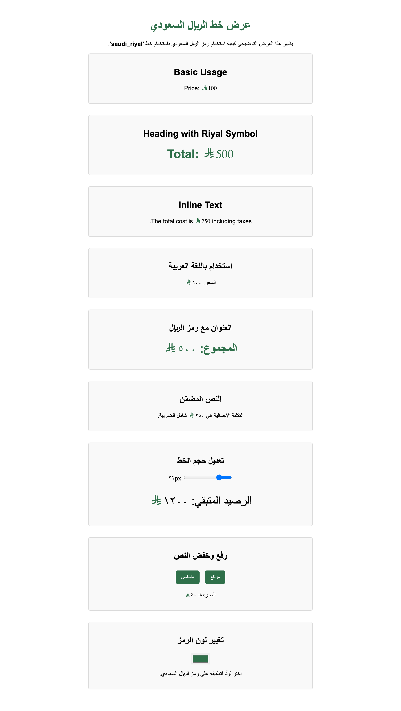

# 🇸🇦 Saudi Riyal Font  

**The official open-source font for the Saudi Riyal currency symbol.**  

This font allows you to use the **Saudi Riyal symbol** in websites, applications, and documents, ensuring compatibility where the symbol is not natively supported.  


---

## 🌍 Live Demo  
🎉 **Check out the live demo here:**  
🔗 [Saudi Riyal Font Demo](https://emran-alhaddad.github.io/Saudi-Riyal-Font/examples/demo.html)  

Below is a screenshot of the example demo page:  



---

## 📌 Features  
✅ **Cross-Platform Compatibility** – Works on Windows, macOS, Linux, Web, and Mobile.  
✅ **Unicode Private Use Area (`U+E900`)** – Ensures seamless integration.  
✅ **Web-Optimized** – Includes `.woff`, `.woff2`, and `.ttf` formats for fast loading.  
✅ **NPM Support** – Easily install via NPM for web projects.  
✅ **Open Source & Free** – Released under the **SIL Open Font License (OFL)**.  
✅ **Customizable** – Modify and enhance as needed.  

---

## 📥 Download & Installation  

### **1️⃣ Install via NPM (Recommended for Web Developers)**  
The easiest way to use this font in a web project is by installing it via NPM:  

```sh
npm install @emran-alhaddad/saudi-riyal-font
```

Then, import it in your project:  

```js
import '@emran-alhaddad/saudi-riyal-font/index.css';
```

Use it in HTML:  

```html
<span class="icon-saudi_riyal"></span>
```

Alternatively, insert the symbol using Unicode:  

```html
<span style="font-family: 'saudi_riyal'">&#xE900;</span>
```

---

### **2️⃣ Web Usage (Manual Installation)**  
Use the font in your **HTML** with the predefined class:  
```html
<span class="icon-saudi_riyal"></span>
```

Alternatively, apply the font manually using Unicode:  
```html
<span style="font-family: 'saudi_riyal'">&#xE900;</span>
```

#### **Include the font in CSS (if needed)**
```css
@font-face {
    font-family: 'saudi_riyal';
    src: url('fonts/saudi_riyal.woff2') format('woff2'),
         url('fonts/saudi_riyal.woff') format('woff'),
         url('fonts/saudi_riyal.ttf') format('truetype');
    font-weight: normal;
    font-style: normal;
}
```

---

### **3️⃣ Desktop Installation (Windows & Mac)**  
1. Download `saudi_riyal.ttf`.  
2. **Windows:** Right-click → "Install".  
3. **Mac:** Double-click the file → "Install".  
4. Open **Microsoft Word, Photoshop, or any editor**, select `"saudi_riyal"` as the font, and type `E900`.  

---

### **4️⃣ Desktop Installation (Linux)**  
1. Copy the font to your local fonts directory:  
   ```sh
   cp saudi_riyal.ttf ~/.fonts/
   fc-cache -fv
   ```
2. Use it in applications that support custom fonts.  

---

### **5️⃣ Usage in Microsoft Word**  
1. Install the font as mentioned above.  
2. Type `E900`, then press `Alt + X` (Windows) or `Cmd + Option + X` (Mac).  
3. The Saudi Riyal symbol will appear.  

---

## 🌍 CDN Hosting (Optional)  
For quick web implementation, use a CDN like GitHub Pages or upload it to Google Fonts (pending approval).  

Example using a direct link:  
```html
<link href="https://cdn.example.com/saudi_riyal.css" rel="stylesheet">
```

---

## 🛠️ Development & Contributions  
We welcome **contributions!** To contribute:  
1. **Fork** this repository.  
2. **Make your changes** (improve the font, add glyphs).  
3. **Submit a Pull Request** for review.  

If you find issues, please report them via the [Issues](https://github.com/emran-alhaddad/saudi-riyal-font/issues) section.  

---

## 📜 License  
This font is released under the **SIL Open Font License (OFL)**.  
✅ **Attribution is required!**  

📌 **Created by:** **Emran Alhaddad**  
📧 **Contact:** emran.alhaddad.dev@gmail.com  

📢 **Any usage, modification, or distribution must credit the original creator.**  
```
Saudi Riyal Font © Emran Alhaddad - Used under SIL Open Font License 1.1
```

---

## 📧 Contact  
📩 For questions, feedback, or collaborations, reach out via [GitHub Issues](https://github.com/emran-alhaddad/saudi-riyal-font/issues) or email at **emran.alhaddad.dev@gmail.com**.  

---

🚀 **Enjoy the Saudi Riyal Font!**  
