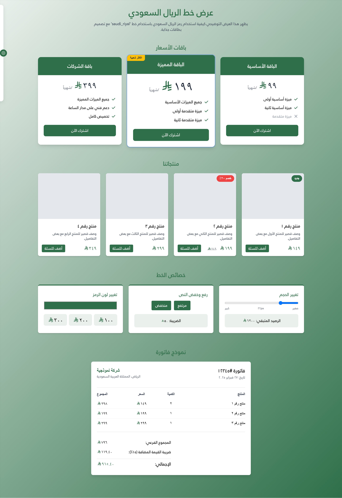

# 🇸🇦 Saudi Riyal Font

**A community‑maintained open‑source font for the Saudi Riyal currency symbol.**

This package provides web‑, mobile‑ and desktop‑ready fonts to display the Saudi Riyal currency symbol.  It makes the currency symbol available even before your platform or operating system supports it natively.  The font ships with both **regular** and **bold** weights and supports two different code points:

- **U+20C1** – the forthcoming Saudi Riyal sign scheduled to be encoded in Unicode 17.  This is the officially proposed code point for the symbol and is recommended for new projects.
- **U+E900** – a private‑use code point.  Older versions of this font used U+E900 as a placeholder until Unicode assigned a code point in the currency symbols block.  For backwards compatibility you can continue to use it; however, when possible you should migrate to **U+20C1**.


---

## 📦 Package Information

[](https://www.npmjs.com/package/@emran-alhaddad/saudi-riyal-font)
[](https://www.npmjs.com/package/@emran-alhaddad/saudi-riyal-font)
[](https://www.jsdelivr.com/package/npm/@emran-alhaddad/saudi-riyal-font)
[](https://github.com/emran-alhaddad/Saudi-Riyal-Font)
[](https://emran-alhaddad.github.io/Saudi-Riyal-Font/examples/demo.html)

## 📊 Repository Stats

[](https://github.com/emran-alhaddad/Saudi-Riyal-Font/stargazers)
[](https://github.com/emran-alhaddad/Saudi-Riyal-Font/network/members)
[](https://github.com/emran-alhaddad/Saudi-Riyal-Font/issues)
[](https://github.com/emran-alhaddad/Saudi-Riyal-Font)
[](https://github.com/emran-alhaddad/Saudi-Riyal-Font/graphs/contributors)
[](https://github.com/emran-alhaddad/Saudi-Riyal-Font/releases)
[](https://github.com/emran-alhaddad/Saudi-Riyal-Font/commits)

## 🔄 Compatibility

[](https://emran-alhaddad.github.io/Saudi-Riyal-Font/examples/demo.html)
[](https://github.com/emran-alhaddad/Saudi-Riyal-Font)
[](https://www.typescriptlang.org/)

## 📈 Project Status

[](https://github.com/emran-alhaddad/Saudi-Riyal-Font/blob/main/LICENSE.txt)
[](https://emran-alhaddad.github.io/Saudi-Riyal-Font/examples/demo.html)
[](https://github.com/emran-alhaddad/Saudi-Riyal-Font/graphs/commit-activity)
[](https://github.com/emran-alhaddad/Saudi-Riyal-Font/pulls)
[](https://opensource.org/)

## 🌍 Live Demo

🎉 **Check out the live demo here:**  
🔗 [Saudi Riyal Font Demo](https://emran-alhaddad.github.io/Saudi-Riyal-Font/examples/demo.html)

Below is a screenshot of the example demo page:



---

## 📌 Features

👉 **Cross‑Platform Compatibility** – Works on Windows, macOS, Linux, Web, and Mobile.  
👉 **Dual Code Points** – Supports the future Unicode code point `U+20C1` and a legacy private‑use area code point `U+E900`.  
👉 **Regular & Bold Weights** – Ships with true regular and bold fonts for consistent typography.  
👉 **Web‑Optimized** – Includes `.woff`, `.woff2` and `.ttf` formats for fast loading.  
👉 **NPM Support** – Easily install via NPM for web projects.  
👉 **CDN Hosting** – Use without installation via **jsDelivr** or **unpkg**.  
👉 **Open Source & Free** – Released under the **SIL Open Font License (OFL)**.  
👉 **Customizable** – Modify and enhance as needed.

---

## 💍 Installation & Usage

### 1️⃣ Install via NPM (Recommended for Web Developers)

Install the package:

```

npm install @emran-alhaddad/saudi-riyal-font

````

Then import the bundled stylesheet in your project:

```js
import "@emran-alhaddad/saudi-riyal-font/index.css";
````

Use the symbol in HTML by adding one of the provided icon classes.  The package defines classes for both the legacy private‑use code point and the new Unicode code point:

```html
<!-- Private‑use code point (U+E900) -->
<span class="icon-saudi_riyal"></span> 100
<span class="icon-saudi_riyal_bold"></span> 100

<!-- New Unicode code point (U+20C1) -->
<span class="icon-saudi_riyal_new"></span> 100
<span class="icon-saudi_riyal_bold_new"></span> 100
```

Each class uses the appropriate font weight and code point.  You can adjust the size and colour through standard CSS (for example `font-size` or `color`).

---

### 2️⃣ Web Usage via CDN (No Installation Needed)

If you prefer not to install the package, you can load the CSS directly from a CDN:

#### 📌 Use jsDelivr CDN

```html
<link
  rel="stylesheet"
  href="https://cdn.jsdelivr.net/npm/@emran-alhaddad/saudi-riyal-font/index.css" />
```

#### 📌 Use unpkg CDN

```html
<link
  rel="stylesheet"
  href="https://unpkg.com/@emran-alhaddad/saudi-riyal-font/index.css" />
```

You can then use the same icon classes as shown above.

---

### 3️⃣ Manual Integration & Custom CSS

If you are embedding the font manually (for example in a custom project or when compiling your own CSS), declare the font using `@font-face` and choose the code point you wish to display.  The folder structure changed in **version 1.1.0**: regular and bold weights now live under `fonts/regular` and `fonts/bold`.

Here is an example of how to load both weights and define icon classes for the two code points:

```css
@font-face {
  font-family: "saudi_riyal";
  src: url("fonts/regular/saudi_riyal.woff2") format("woff2"),
       url("fonts/regular/saudi_riyal.woff") format("woff"),
       url("fonts/regular/saudi_riyal.ttf") format("truetype");
  font-weight: normal;
  font-style: normal;
}

@font-face {
  font-family: "saudi_riyal_bold";
  src: url("fonts/bold/saudi_riyal.woff2") format("woff2"),
       url("fonts/bold/saudi_riyal.woff") format("woff"),
       url("fonts/bold/saudi_riyal.ttf") format("truetype");
  font-weight: bold;
  font-style: normal;
}

/* Legacy private‑use code point (U+E900) */
.icon-saudi_riyal::before {
  content: "\e900";
  font-family: "saudi_riyal" !important;
  font-size: inherit;
  color: inherit;
}

.icon-saudi_riyal_bold::before {
  content: "\e900";
  font-family: "saudi_riyal_bold" !important;
  font-size: inherit;
  color: inherit;
}

/* New Unicode currency sign (U+20C1).  Use this when your platform or font stack supports Unicode 17 or when you wish to future‑proof your site. */
.icon-saudi_riyal_new::after {
  content: "\20c1";
  font-family: "saudi_riyal" !important;
  font-size: inherit;
  color: inherit;
}

.icon-saudi_riyal_bold_new::after {
  content: "\20c1";
  font-family: "saudi_riyal_bold" !important;
  font-size: inherit;
  color: inherit;
}
```

After adding this CSS to your project, use the appropriate class on an inline element (e.g., `<span>` or `<i>`).  For example:

```html
Price: <span class="icon-saudi_riyal_new"></span> 50.00
```

> **Note:** If the symbol appears slightly higher than the surrounding text in your specific design, you can adjust its vertical position with CSS.  For instance, wrap the symbol in a container and use `vertical-align: -0.1em` on the container to nudge it down.

---

### 🧠 React Native / Expo Usage

The JavaScript entry point of this package uses the browser `URL` API to locate font assets.  When running under React Native with the Hermes engine (for example, Expo SDK 53), the `URL` API is not implemented.  This causes an error like:

```
ERROR [runtime not ready]: Error: URL.protocol is not implemented, js engine: hermes
ERROR [runtime not ready]: Invariant Violation: "main" has not been registered.
```

To use the Saudi Riyal Font in React Native or Expo:

1. **Install a URL polyfill (recommended)** – Install [`react-native-url-polyfill`](https://github.com/zmotree/react-native-url-polyfill) and import it before any other code.  This polyfills `URL.protocol` and related methods so Hermes can run code that depends on the `URL` API.

   ```
   npm install react-native-url-polyfill
   ```

   ```js
   // In your entry file (e.g. index.js or App.tsx)
   import "react-native-url-polyfill/auto";
   // ...rest of your imports
   ```

2. **Load the font file directly** – Alternatively, skip the JavaScript entry point of this package and load the `.ttf` file directly with `expo-font`:

   ```js
   import { useFonts } from "expo-font";
   // Adjust the path to the TTF files as needed
   const [loaded] = useFonts({
     SaudiRiyal: require("./node_modules/@emran-alhaddad/saudi-riyal-font/fonts/regular/saudi_riyal.ttf"),
     SaudiRiyalBold: require("./node_modules/@emran-alhaddad/saudi-riyal-font/fonts/bold/saudi_riyal.ttf"),
   });
   ```

   Once the font is loaded, apply it by name in your styles.  Use different font families for the symbol and the surrounding text to avoid digits disappearing when combined with the symbol.

For more details or to track progress on React Native support, see [issue #19](https://github.com/emran-alhaddad/Saudi-Riyal-Font/issues/19).

---

### 4️⃣ Download & Install on Windows, Mac, Linux, Android & iOS

If you need the font for desktop or mobile applications, you can download the `.ttf` files and install them manually.  The files live under the `fonts/regular` and `fonts/bold` directories in this repository.  Detailed instructions are provided in the [TROUBLESHOOTING guide](./TROUBLESHOOTING.md) for each platform.

---

## 🔧 Troubleshooting & FAQ

If you encounter issues such as misaligned symbols, problems in `<select>` elements, email templates, wkhtmltopdf, mobile applications, or frameworks that override the font, please consult the [troubleshooting guide](./TROUBLESHOOTING.md).  It collects known issues from the project's GitHub issues and provides practical work‑arounds.

---

## 🌟 Development & Contributions

We welcome **contributions**!  To contribute:

1. **Fork** this repository.
2. **Make your changes** (improve the font, update examples, add glyphs).
3. **Submit a Pull Request** for review.

If you find issues, please report them via the [Issues](https://github.com/emran-alhaddad/Saudi-Riyal-Font/issues) section.  When filing an issue, please describe the environment, framework, and provide code snippets where applicable.  This helps us reproduce and fix problems quickly.

---

## 📚 License

This font is released under the **SIL Open Font License (OFL)**.  Attribution is required.

```
Saudi Riyal Font © Emran Alhaddad – Used under SIL Open Font License 1.1
```

---

## 📧 Contact

For questions, feedback, or collaborations, reach out via [GitHub Issues](https://github.com/emran-alhaddad/Saudi-Riyal-Font/issues) or email at **[emran.alhaddad.dev@gmail.com](mailto:emran.alhaddad.dev@gmail.com)**.

---

🚀 **Enjoy the Saudi Riyal Font!**
